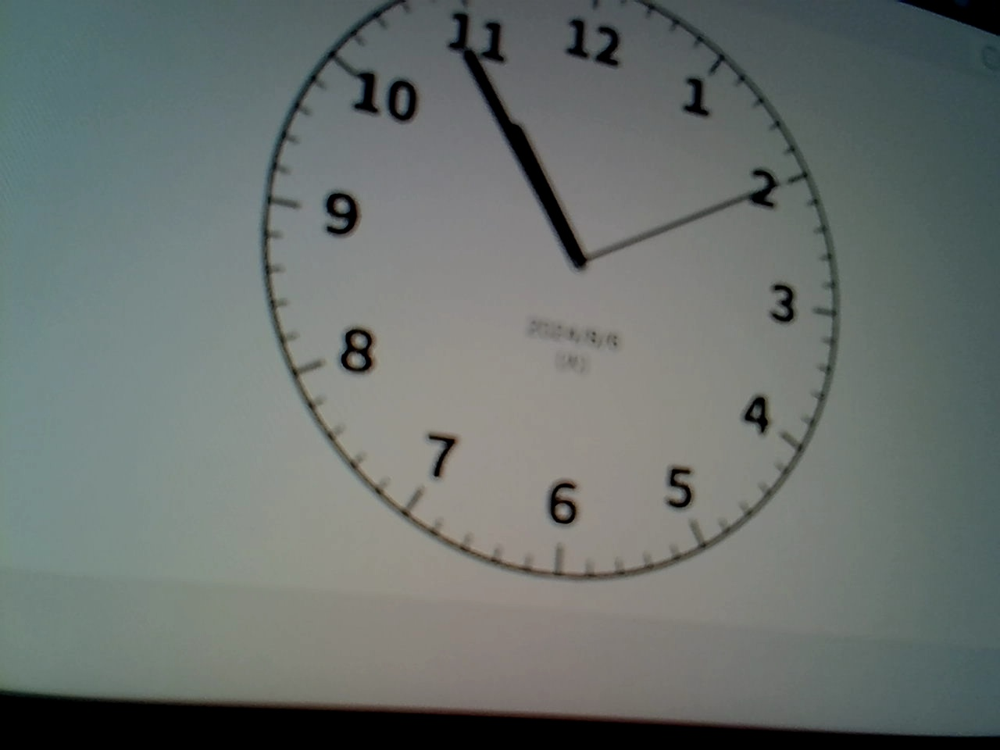
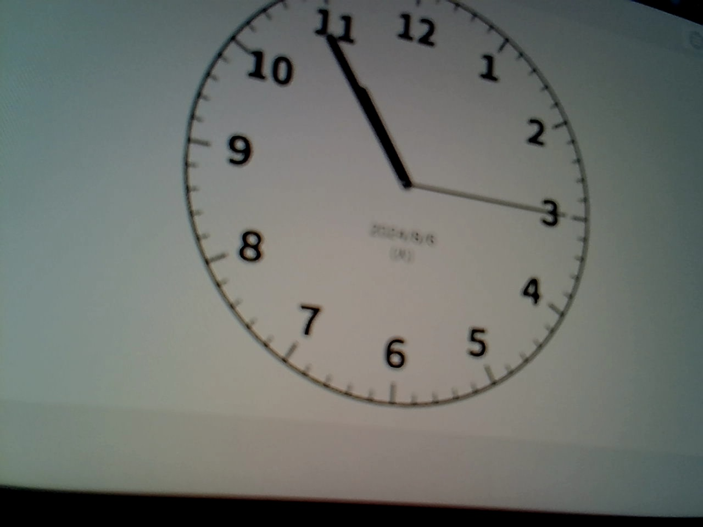
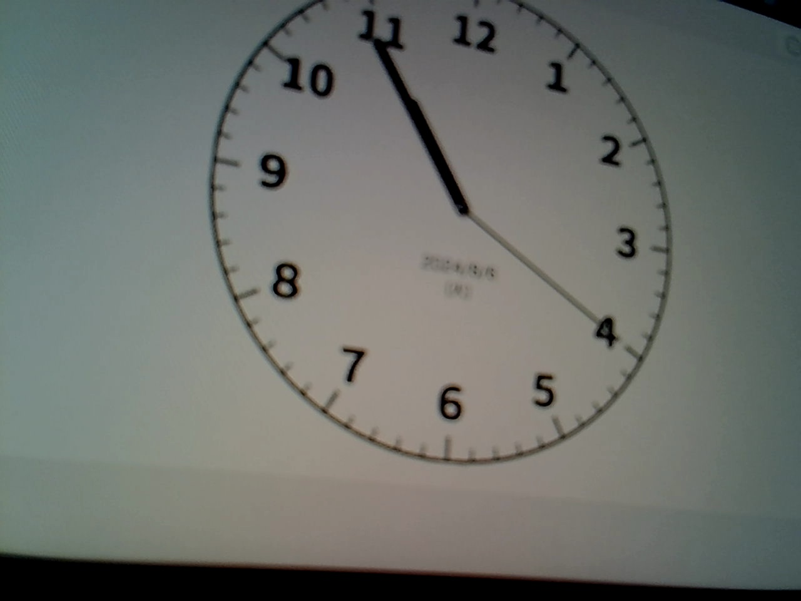
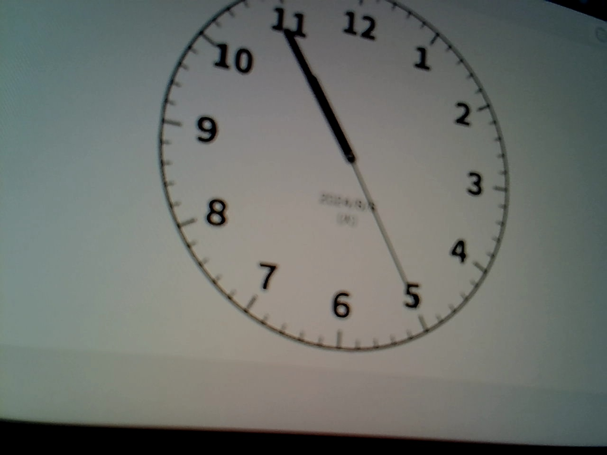

+++
title = 'cv2.VideoCapture()で常に最新のフレームを取得する方法'
date = 2024-08-06T22:10:48+09:00
draft = false
summary = "今回の検証環境では特別な操作をしなくても常に最新のフレームが取得できた。取得できないケースが再現できたらまた記事を更新する。"
+++


## 前提

- 今回の検証環境では特別な操作をしなくても常に最新のフレームが取得できた
- 取得できないケースが再現できたらまた記事を更新する


### 検証環境

- macOS(12.6, Monterey), Apple M1 Pro
- Python 3.10.4 (venv)
- opencv-python==4.10.0.84
- ロジクール ウェブカメラ C270n HD 720P


## cv2.VideoCapture()で5秒おきにカメラ画像を保存 

アナログ時計を表示しているwebサービスを被写体に使う  
`アナログ時計`  
https://watch.onl.jp/


<details>

<summary>
コード
</summary>

```python
import os
import time

import cv2


def main(dir_save: str):

    os.makedirs(dir_save, exist_ok=True)

    # setup
    cap = cv2.VideoCapture(0)
    print(cap.get(cv2.CAP_PROP_FPS))

    cnt = 0
    while True:
        try:
            ret, frame = cap.read()
            if ret:
                # 5秒おきにカメラ画像を保存
                time.sleep(5)
                print(cnt)
                path_save = os.path.join(dir_save, f"{str(cnt).zfill(3)}.jpg")
                cv2.imwrite(path_save, frame)

            cnt += 1
        except Exception as e:
            print(e)
            break

    cap.release()


if __name__ == "__main__":
    dir_save = "save"
    main(dir_save)

```
</details>


経過秒数 | image
-- | --
| 5 |  |  
| 10 |  |  
| 15 |  |  
| 20 |  |  


- 5秒経過するごとに、保存した画像でもちゃんと秒針が5秒進んでいる...
- 以前jetson nanoで検証した際はバッファに古いキャプチャ画像が溜まっており、常に最新のキャプチャ画像を取得できていなかったが、今回の環境では何も異常がないようだ


## 参考記事

以前最新のキャプチャ画像が取得されなかった際は、以下の記事で紹介しているQueueとThreadを使った方法で最新のキャプチャ画像を取得できた

- `How to disable Buffer in OpenCV Camera?`2019
    - https://stackoverflow.com/questions/54460797/how-to-disable-buffer-in-opencv-camera


